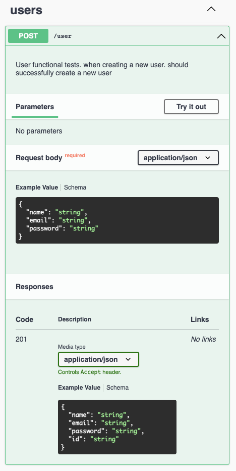
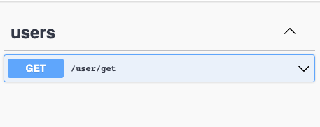
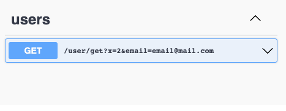

# About

The idea with this module is to always keep your API docs up to date. How to achieve that? Generate your docs based on your test suite by modifying your current setup as little as possible.

# Demonstration

Let's say that we have the following tests for users

```js
describe('User functional tests.', () => {
  beforeEach(async () => {
    await User.deleteMany({});
  });

  describe('when creating a new user.', () => {
    it('should successfully create a new user', async () => {
      const newUser = {
        name: 'John Doe',
        email: 'john@mail.com',
        password: '1234',
      };
      const { body, status } = await global.testRequest
        .post('/user')
        .send(newUser);
      expect(status).toBe(201);
      await expect(
        AuthService.comparePasswords(newUser.password, body.password)
      ).resolves.toBeTruthy();
      expect(body).toEqual(
        expect.objectContaining({ ...newUser, password: expect.any(String) })
      );
    });

    it('should receive an error when creating user with invalid email', async () => {
      const newUser = {
        name: 'John Doe',
        email: 'john',
        password: '1234',
      };
      const { body, status } = await global.testRequest
        .post('/user')
        .send(newUser);
      expect(status).toBe(422);
      expect(body).toEqual({
        code: 422,
        error: 'User validation failed: email: john is not a valid email',
      });
    });
  });
});
```

It will generate the documentation based your on test and test description.



# Dependencies

To attache this into your project you must be using express, jest, and some test tool to actually hit the express middleware like supertest.

# Setup

Quite simple to setup everthing.

```
npm i test-driven-documentation
```

## Setup express middleware

The first step is to use our express middleware. 
Note that docMiddleware is a function that returns a middleware. Just pass `true` if you want to generate docs.

```js
import { docMiddleware } from 'test-driven-documentation';
app.use(docMiddleware(process.env.GENERATE_DOCS === 'true'))
```

## Setup jest functions

You must create an empty doc file in your root. eg: `docs.json`

After that you should import `testSetup`

```js
import { testSetup } from 'test-driven-documentation';
```

and on your jest's functions afterAll and afterEach call:

```js
afterAll(() => {
  testSetup.afterAll('docs.json');
});

afterEach(() => {
  testSetup.afterEach(expect.getState());
});
```

## Generate docs

You must have a Global teardown function setup to properly generate your documentation. Currently we're supporting only `swagger` docs with OpenAPI version setup to 3.0.0.

```js
import { generateSwaggerDocs300 } from 'test-driven-documentation';

const teardown = () => {
  if (process.env.GENERATE_DOCS === 'true'){
    generateSwaggerDocs300('docs.json', {
      info: {
        version: '1.1.0',
        title: 'your title',
        description: 'your description',
        termsOfService: 'your terms of service',
        contact: {
          name: 'name',
          email: 'email@mail.com,
          url: 'yoururl,
        },
        license: {
          name: 'yourlicense',
          url: 'licenseurl',
        },
      },
      servers: [
        {
          url: 'http://localhost:3000',
        },
      ],
    });
  }
};

module.exports = teardown;
```

# Running

```
GENERATE_DOCS=true && npm test
```

That will create a test object for every success response from supertest that was caught from our express middleware.

After running everything globalteardown will generate the documentation itself in that `docs.json` file, or whatever file you specified.

# Customizing

It will be possible to customize each test into the documentation. Currently we're supporting only string params into the test description by adding `@docs` into your test description. Everything after `@docs` will be considered a command to customize your docs.

### Example:

```js
it('should return something @docs showQueryParamsUrl=false', async () => {
  const { body } = await global.testRequest
    .get('/user/get?x=2&email=email@mail.com')
    .set({ 'x-access-token': 'xxx' });
  expect(body).not.toBe(null);
});
```

That `showQueryParamsUrl = false` will not show the query params into the url seen on swagger.



If `@docs showQueryParamsUrl=false` was not passed. We would see:



# Future releases

This is still on very early stages. In the future we will add:

- Tests
- Improve custom configs
- Code refactoring
- Support other documentation tools

# Limitations

TBD